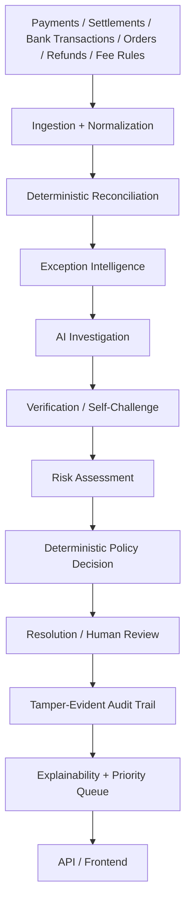

# ReconcileAI

An explainable, deterministic-gated multi-source settlement reconciliation agent — built for Razorpay AI Buildathon 2026, Track 04: AI Finance Controller. It investigates hard reconciliation exceptions with AI, but never lets AI make the financial decision.

## The Problem

Finance teams reconcile records across multiple sources — payments, settlement reports, bank transactions, internal orders, refunds, and fees — that legitimately disagree because of settlement timing, fee deductions, partial/split/aggregated settlements, duplicates, and mangled reference IDs. Getting this wrong either misses real money or wrongly clears something that needed a human's judgment. Most reconciliation tools stop at flagging a mismatch; they don't investigate why it happened.

## The Core Idea

**"AI investigates. Verification challenges. Policy decides. Audit proves."**

In plain language: deterministic matching handles the clean majority of records — no AI involved at all. For the genuinely ambiguous residual (is this fee deduction expected or an error? is this a duplicate charge or a second legitimate one?), an AI investigator proposes one structured hypothesis, citing only evidence it actually retrieved. That hypothesis is then independently re-checked with exact arithmetic against the real records by a completely separate deterministic system. A policy engine — not the AI — is the only thing that ever decides the outcome, and it structurally never reads the AI's own confidence score or recommendation. Every step is written to a tamper-evident audit trail.

**Why AI is used at all:** classifying the root cause of a genuinely ambiguous exception requires synthesizing evidence across several related records in a way that doesn't reduce to a fixed rule — that's a real, non-trivial judgment call, and it's the one part of this problem deterministic code alone can't cover well.

**Why AI is never trusted with the final decision:** an AI hypothesis can be wrong, confidently. So its confidence score and recommended action are recorded for audit only and are never read by the policy engine — the decision is made entirely by code that independently re-derives the claim from the real payment, settlement, and bank-transaction records.

## Architecture



Every stage above is a real, tested module (`app.ingestion`, `app.engines.reconciliation`, `app.engines.exceptions`, `app.ai`, `app.challenge`, `app.engines.risk`, `app.policy`, `app.audit`, `app.explainability`, `app.prioritization`, `app.api`, `frontend/`). See `docs/architecture.md` for the full design and `docs/final-winning-audit.md` §6 for the traced AI-to-decision data flow.

## What ReconcileAI Can Detect

A fixed, 14-category exception taxonomy (plus clean exact matches, which are not treated as exceptions): missing transaction, duplicate, partial settlement, over-settlement, under-settlement, fee mismatch, refund mismatch, timing mismatch, reference mismatch, split settlement, aggregated settlement, reversed transaction, ambiguous match, and unexplained difference.

## Safety-First AI Design

- **AI's recommendation is not authoritative.** `AIHypothesis.confidence` and `recommended_action` are stored for audit/comparison only and are never read by the policy engine.
- **Verification independently checks evidence.** Every AI claim is re-derived with exact (Decimal, never floating point) arithmetic against the real records by a completely separate deterministic system, dispatching each hypothesis type to the one real financial checker for that claim.
- **The policy engine decides.** A fixed four-tier precedence (safety blocks first, then mandatory-approval rules, then risk thresholds, and only last, auto-resolution eligibility) is the sole financial authority, with a fail-closed default (`HUMAN_REVIEW`, never `SAFE_TO_RESOLVE`, if no tier can confirm safety).
- **Contradictions block unsafe resolution.** When AI's hypothesis is independently disproven, it is recorded as a contradiction that forces mandatory human review — never silently resolved either way.
- **Audit proves what happened.** Every hypothesis, verification result, contradiction, and policy decision is written to an append-only, SHA-256 hash-chained ledger with no update/delete method — reconstructable from a single exception ID.

## Results

Measured on a 300-record, ground-truthed synthetic evaluation set (see `docs/final-validation.md` / `docs/final-winning-audit.md` for full methodology):

| Metric | Value |
|---|---|
| Auto-resolved | 219 |
| Human review | 67 |
| Rejected / blocked | 2 |
| Unresolved | 12 |
| Unsafe auto-resolutions | **0 / 300 (0.0000%)** |
| Naive fuzzy-matching baseline (no verification gate), identical dataset | 14.67% unsafe auto-resolution rate |
| Backend tests passing | 861 |
| Frontend (Vitest) tests passing | 20 |
| Frontend (Playwright) E2E tests passing | 1 |

**Golden adversarial case:** a real ₹9.83 fee-mismatch record. AI proposes a card-fee explanation → deterministic verification finds the actual fee rule doesn't produce that residual → contradiction recorded → policy requires `HUMAN_REVIEW`, never auto-resolves.

No additional metrics beyond the above are claimed here — all measurements use the synthetic dataset and `MockAIProvider` described below, clearly labeled as such throughout.

## Demo

- **Synthetic fixture mode is the default** for both the reconciliation dataset and the Razorpay provider adapter — the demo runs entirely offline and deterministically.
- **`MockAIProvider` is used throughout** for deterministic, reproducible evaluation and demos — this is intentional, not a placeholder for a missing feature.
- **Live Razorpay mode has NOT been exercised** against a real API in this environment (no production credentials exist here) — the adapter code exists and is tested against simulated HTTP responses only.
- **A live LLM provider has NOT been exercised** against a real vendor API — `GeminiProvider`/`OpenAICompatibleProvider` exist as real code but are untested against a live model.

See:
- [`docs/three-minute-demo.md`](docs/three-minute-demo.md) — the exact timed judge demo script
- [`docs/demo-runbook.md`](docs/demo-runbook.md) — full setup, golden path, and reset instructions
- [`docs/judge-qa.md`](docs/judge-qa.md) — anticipated judge questions, answered against real code/tests
- [`docs/final-validation.md`](docs/final-validation.md) — the complete, source-cited judge evidence package

## Getting Started

```bash
# Backend
cd backend
pip install -r requirements.txt
uvicorn app.main:app --host 127.0.0.1 --port 8000

# Frontend (separate terminal)
cd frontend
npm install
npm run dev
# open http://localhost:5173
```

No internet access is required — the dataset is local (`data/synthetic/seeds`) and the AI provider is `MockAIProvider` (fully deterministic, zero network calls).

## Testing

Commands as actually configured in this repository (`pytest.ini`, `frontend/package.json`):

```bash
# Backend — full suite (pytest.ini: testpaths = backend/tests), from the repo root
python -m pytest -q

# Frontend — Vitest unit/component suite
cd frontend && npm test

# Frontend — Playwright browser E2E suite (requires both servers running, see docs/demo-runbook.md)
cd frontend && npm run test:e2e

# Terminal-only full pipeline demo, no UI dependency
python scripts/run_reconciliation.py

# Competitive baseline evaluation
python scripts/evaluate_competitive_baselines.py

# Dataset quality audit
python scripts/audit_dataset.py
```

## Repository Structure

```
backend/        FastAPI application: reconciliation, AI, policy, audit, API (app/), tests (tests/)
frontend/       React + TypeScript + Vite frontend, Vitest + Playwright tests
data/synthetic/ The 300-record ground-truthed dataset, seeds, and provider fixtures
scripts/        Benchmarks, evaluation harnesses, and the terminal demo entry point
docs/           Architecture, safety, demo, and validation documentation (see below)
shared/         Money/taxonomy helpers shared between the generator and the backend
CLAUDE.md       Full project history, architectural decisions, and current status
PROJECT_PLAN.md Milestone-by-milestone build record
```

## Documentation

- [`docs/demo-runbook.md`](docs/demo-runbook.md) — full setup, golden path, and reset instructions
- [`docs/three-minute-demo.md`](docs/three-minute-demo.md) — the exact timed judge demo script
- [`docs/judge-qa.md`](docs/judge-qa.md) — anticipated judge questions, answered against real code/tests
- [`docs/final-validation.md`](docs/final-validation.md) — the complete, source-cited judge evidence package
- [`docs/final-winning-audit.md`](docs/final-winning-audit.md) — the full requirement/safety/competitive audit
- [`docs/winning-thesis.md`](docs/winning-thesis.md) — the 30-second/60-second/2-minute pitch
- [`docs/presentation-blueprint.md`](docs/presentation-blueprint.md) — recommended slide-by-slide deck structure
- [`docs/demo-failure-plan.md`](docs/demo-failure-plan.md) — live-judging failure modes and recovery
- [`docs/production-readiness.md`](docs/production-readiness.md) — honest READY/PARTIAL/NOT IMPLEMENTED matrix
- [`docs/evaluation.md`](docs/evaluation.md) — the measured evaluation methodology and results

## Limitations

Stated plainly, not hidden:

- No live LLM provider has ever been exercised against a real vendor API.
- No live Razorpay API call has ever been made against a real endpoint.
- SQLite and in-memory registries — this is a demo-scale architecture, not a production deployment.
- `RunRegistry` and `ApprovalWorkflowStore` are in-memory and process-lifetime only; no persisted human review/approval workflow exists over HTTP.
- No deployment, monitoring, backup, or disaster-recovery infrastructure exists.
- The system is **not** claimed to be production-ready.

Full detail in `docs/production-readiness.md` and `CLAUDE.md`'s "Known limitations" section.
