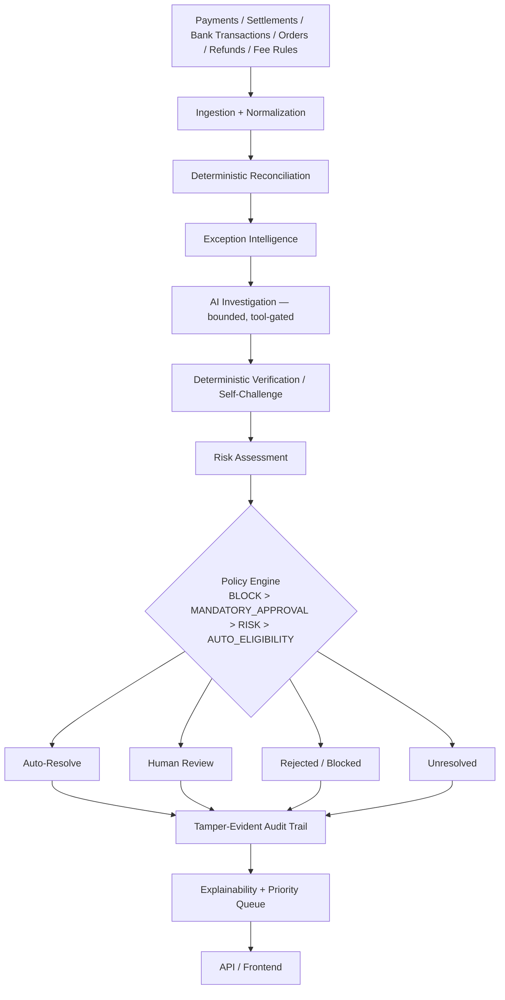

# ReconcileAI

**Deterministic-Gated Exception & Settlement Controller** — an explainable, multi-source settlement reconciliation agent built for the **Razorpay AI Buildathon 2026, Track 04: AI Finance Controller**.

> ReconcileAI doesn't ask you to trust AI with your money.
> **AI investigates. Verification challenges. Policy decides. Audit proves.**


All test-count badges above reflect a full local run against this exact repository state (see [Testing](#testing)) — not a hosted CI badge, since none is configured here.

---

## Table of contents

1. [Why this matters](#why-this-matters)
2. [The key idea](#the-key-idea)
3. [Architecture](#architecture)
4. [Reconciliation pipeline](#reconciliation-pipeline)
5. [Why AI is safe here](#why-ai-is-safe-here)
6. [Results / evaluation](#results--evaluation)
7. [Golden adversarial case — safety proof](#golden-adversarial-case--safety-proof)
8. [Exception intelligence](#exception-intelligence)
9. [Auditability](#auditability)
10. [Work Queue / product UI](#work-queue--product-ui)
11. [API](#api)
12. [Razorpay integration](#razorpay-integration)
13. [AI provider](#ai-provider)
14. [Security / adversarial testing](#security--adversarial-testing)
15. [Technology stack](#technology-stack)
16. [Project structure](#project-structure)
17. [Quick start](#quick-start)
18. [Deployment](#deployment)
19. [Testing](#testing)
20. [Demo](#demo)
21. [Limitations / production-hardening boundary](#limitations--production-hardening-boundary)
22. [Track 04 relevance](#track-04-relevance)
23. [Documentation](#documentation)
24. [Final positioning](#final-positioning)

---

## Why this matters

Finance teams reconcile records across sources that legitimately disagree — not because anything is broken, but because settlement is genuinely messy:

- **Payment reports** (what the customer paid)
- **Settlement reports** (what actually landed, net of fees)
- **Bank transactions** (what the bank confirms was credited)
- **Internal order ledger** (what the merchant's own system expected)
- **Refunds** (partial or full reversals)
- **Fee rules** (the deductions that explain — or fail to explain — a gap)

A mismatch can be timing (settlement lags the payment by days), an ID that got reformatted, a fee that was or wasn't applied, a partial/split/aggregated settlement, or a genuine duplicate. Getting this wrong either misses real money or wrongly clears something that needed a human's judgment. Most reconciliation tooling stops at "flag the mismatch." ReconcileAI investigates *why*, then decides *safely*.

## The key idea

**AI proposes. Deterministic system verifies. Policy engine decides. Audit proves.**

Deterministic matching handles the clean majority of records — no AI involved at all. For the genuinely ambiguous residual, a bounded AI investigator proposes one structured, evidence-citing hypothesis. That hypothesis is then independently re-derived with exact `Decimal` arithmetic against the real records by a completely separate deterministic verifier. A policy engine — never the AI — is the sole financial decision authority, and it structurally never reads the AI's confidence score or recommended action. Every step is written to a tamper-evident, hash-chained audit trail.

## Architecture



Every stage above is a real, tested module — `app.ingestion`, `app.engines.reconciliation`, `app.engines.exceptions`, `app.ai`, `app.challenge`, `app.engines.risk`, `app.policy`, `app.audit`, `app.explainability`, `app.prioritization`, `app.api`, `frontend/`. Full design detail: [`docs/architecture.md`](docs/architecture.md); the traced AI-to-decision data flow: [`docs/final-winning-audit.md`](docs/final-winning-audit.md) §6.

## Reconciliation pipeline

```
ingestion → normalization → deterministic matching
   → residual / exception investigation → AI investigation
   → deterministic verification (self-challenge)
   → risk assessment → policy decision
   → resolution / human review / rejection
   → tamper-evident audit trail
```

Each arrow is a real function call in `app.services.reconciliation_pipeline.run_reconciliation_pipeline` — the one orchestrator every API call and the terminal demo (`scripts/run_reconciliation.py`) actually goes through. No stage is a UI-only illustration.

## Why AI is safe here

- **AI is not the final financial authority.** `AIHypothesis.confidence` and `recommended_action` are stored for audit/comparison only and are **never read** by the policy engine.
- **AI confidence does not authorize resolution.** No code path converts a confidence score into `SAFE_TO_RESOLVE`.
- **Deterministic verification can reject an AI hypothesis outright.** Every claim is re-derived with exact `Decimal` arithmetic against the real payment/settlement/bank-transaction records by a separate verifier, dispatching each hypothesis type to the one true financial checker for that claim.
- **Policy is deterministic.** A fixed four-tier precedence — safety **BLOCK**S first, then mandatory-approval rules, then risk thresholds, and only last, auto-resolution eligibility — with a fail-closed default (`HUMAN_REVIEW`, never `SAFE_TO_RESOLVE`, if no tier can confirm safety).
- **AI cannot directly mutate financial records.** No AI-reachable code path writes to `Payment`, `Settlement`, `BankTransaction`, `Refund`, or `Order`; only the policy layer's resolution/review workflow does, and only after policy — not AI — decides.
- **Unsafe AI/provider behavior fails closed.** A timeout, malformed response, or hallucinated reference from the AI provider is caught and routed to `HUMAN_REVIEW`/`UNRESOLVED`, never silently treated as a resolved case.
- **Audit preserves decision provenance.** Every hypothesis, verification result, contradiction, and policy decision is written to an append-only, SHA-256 hash-chained ledger with no update/delete method — reconstructable from a single exception ID.

## Results / evaluation

Measured on a **300-record, ground-truthed synthetic evaluation set**, verified fresh against this exact repository state (`scripts/run_reconciliation.py`, `scripts/evaluate_competitive_baselines.py`, `scripts/audit_dataset.py`):

| Outcome | Count |
|---|---|
| Clean exact matches (deterministic, no exception raised) | 138 |
| Actionable exceptions investigated | 162 |
| **Auto-resolved** | **219** |
| **Human review** | **67** |
| **Rejected / blocked** (`POLICY-VERIFIER-FAIL-001`) | **2** |
| **Unresolved** | **12** |
| **Unsafe auto-resolutions** | **0 / 300 (0.0000%)** |
| Audit events for the full run | 3,486 (chain: **VALID**) |

Note: 219 + 67 + 2 + 12 = 300. "Clean exact matches" and "auto-resolved" are not the same population double-counted — most clean matches auto-resolve trivially, and a smaller number of investigated exceptions also reach auto-resolution once verified safe.

**Competitive baseline comparison**, same 300-record dataset, same ground truth (`scripts/evaluate_competitive_baselines.py`):

| Baseline | What it does | Precision | Recall | Unsafe auto-resolution rate |
|---|---|---|---|---|
| A — exact-ID matching | Matches only identical reference IDs | 1.0000 | 0.8889 | — |
| B — naive amount-only matching | Matches on amount alone | 0.9583 | 0.8273 | — |
| C — naive fuzzy matching, no verification gate | Fuzzy-matches, resolves without re-checking | — | — | **14.67% (44/300)** |
| D — LLM-only (proxy over this project's own `MockAIProvider`, not an independent pipeline) | Direct AI recommendation, untrusted | — | — | 0.00% (0 of 74 AI-routed cases recommended auto-resolve) |
| E — this project's deterministic reconciliation layer alone | Matching + fee/refund/settlement verification | 1.0000 | 1.0000 | 0.0000% |
| **ReconcileAI (full pipeline: E + AI investigation + policy + audit)** | Full pipeline above | — | — | **0.0000% (0/300)** |

The 14.67% figure is the load-bearing contrast: the same dataset, run through a plausible-but-unverified matching approach, produces a real, non-zero unsafe rate — proving the 0% figure for ReconcileAI isn't an artifact of an easy dataset. Baseline D is explicitly disclosed as a proxy, not a second independent pipeline — no live-model benchmark is claimed anywhere in this project.

Backend/frontend/E2E test counts are in [Testing](#testing).

## Golden adversarial case — safety proof

A synthetic order (`ORD-00157`) settles ₹9.83 short of the expected amount. This is the project's own designed adversarial trap:

1. **AI investigates** and proposes several hypotheses, including `FEE_EXPLAINS_DIFFERENCE` — "a card-processing fee accounts for the ₹9.83 residual."
2. **Deterministic verification challenges every hypothesis** against the real fee rules, refund records, and settlement math — and **contradicts all of them**, including the fee explanation: the configured fee rule does not actually produce this residual.
3. **Policy fires `POLICY-VERIFIER-FAIL-001`** (the BLOCK tier) because a contradicted AI hypothesis is present.
4. **Final decision: `REJECTED`.** No financial action is taken, and no review request is created for a rejected decision — the case is escalated for investigation, not silently cleared.

This is reproduced exactly, on demand, by `python scripts/run_reconciliation.py` and by the Playwright E2E suite's dedicated `₹9.83 fee trap` test — it is not a scripted UI-only demo state.

## Exception intelligence

A fixed 14-category exception taxonomy (plus clean exact matches, which are not treated as exceptions): missing transaction, duplicate, partial settlement, over-settlement, under-settlement, fee mismatch, refund mismatch, timing mismatch, reference mismatch, split settlement, aggregated settlement, reversed transaction, ambiguous match, and unexplained difference. Each category has a dedicated deterministic constraint check (`app.engines.evidence`) before any AI involvement, and a documented root-cause decomposition (`app.engines.root_cause`) that AI hypotheses must survive independent re-verification against.

## Auditability

Every decision is threaded under one `run_id` → `exception_id` → `correlation_id`, and every step (`EXCEPTION_CREATED`, AI hypothesis, verification result, contradiction, policy decision, review action) is an immutable, hash-chained `AuditEvent`. `app.audit.provenance.get_decision_provenance()` reconstructs the full story — what AI believed, what contradicted it, what policy decided, whether approval was required, and whether the chain is still valid — from only an exception ID. `app.audit.verify.verify_chain()` detects tampering (payload, timestamp, actor, event-type modification, deletion, insertion, reordering, forged links) rather than merely asserting integrity.

## Work Queue / product UI

A React + TypeScript SPA (`frontend/src/pages/`) with the pages actually implemented and tested:

- **Overview** — run summary, decision distribution, the headline unsafe auto-resolution rate, sourced live from `/runs/{id}/safety-metrics`.
- **Work Queue** — the deterministic, prioritized finance queue (`/exceptions/queue`): priority tier, SLA/aging, exposure, and reason codes, sorted by a fixed, explainable order — never re-ranked by AI.
- **Reconciliation Records / Exceptions list** — filterable exception list backed by `/exceptions`.
- **Exception Detail** — the full evidence-first explanation: financial summary, AI investigation trace, verification/self-challenge, policy trace, final decision, and audit & provenance — all read directly from `/exceptions/{id}/explanation` and `/exceptions/{id}/provenance`, never hardcoded in the frontend.
- **Runs** — start a reconciliation run and browse run history.
- **Audit Trail** — the run's audit event stream and chain-validity status.
- **System Health / About** — service health and the same headline metrics cited above, sourced from the same live endpoints, never a separate hardcoded copy.

No button anywhere triggers a force-resolve, override, or direct mutation of a financial record — verified directly in the E2E suite and the API security tests below.

## API

FastAPI backend (`backend/app/api/routes/`), 13 endpoints, all read-oriented except starting a run:

| Method | Path | Purpose |
|---|---|---|
| GET | `/health` | Process liveness, no internal state exposed |
| POST | `/runs` | Start a reconciliation run (the only write-heavy operation; serialized by a process-local lock, see [Limitations](#limitations--production-hardening-boundary)) |
| GET | `/runs` | List reconciliation runs |
| GET | `/runs/{run_id}` | Get a stored run summary (never re-runs the pipeline) |
| GET | `/runs/{run_id}/safety-metrics` | Ground-truth-based safety metrics for a run |
| GET | `/runs/{run_id}/audit` | A run's audit chain status |
| GET | `/runs/{run_id}/audit/events` | List a run's audit events |
| GET | `/exceptions` | List exceptions, paginated and filterable |
| GET | `/exceptions/queue` | The deterministic, prioritized work queue |
| GET | `/exceptions/{exception_id}` | One exception's full safe-to-display summary |
| GET | `/exceptions/{exception_id}/provenance` | Full decision provenance |
| GET | `/exceptions/{exception_id}/explanation` | Canonical, evidence-first explanation |
| GET | `/sources/status` | Status of every configured data source (fixture/mock/live) |

No endpoint accepts a caller-supplied decision, force-resolves an exception, or otherwise mutates a financial record outside the policy-gated pipeline above — enforced by dedicated API security tests, not merely by omission.

## Razorpay integration

Stated plainly:

- The repository contains an **isolated, read-only** Razorpay provider adapter (`backend/app/adapters/razorpay_adapter.py`) plus fixture/mock-mode testing against simulated HTTP responses.
- **Live Razorpay mode has NOT been exercised** against a real API in this environment — no production credentials exist here.
- The adapter exposes **no** creation, update, capture, refund, or payout authority — it only fetches payments, settlements, and related records for ingestion into the same validation path as file-sourced data.
- The evaluation and demo results above use **synthetic/fixture data only**.

## AI provider

- `MockAIProvider` is used throughout for deterministic, reproducible evaluation and demos — this is a deliberate design choice for a judged, reproducible submission, not a placeholder for a missing feature.
- Real `GeminiProvider`/`OpenAICompatibleProvider` implementations exist in code (`backend/app/ai/provider.py`) and are unit-tested against simulated responses, but **no live LLM vendor API has been exercised**.
- No live-model accuracy, latency, or cost result is claimed anywhere in this project.

## Security / adversarial testing

Verified categories, not just claimed:

- **Adversarial attack categories (14 lettered categories, `backend/tests/adversarial/`):** identifier manipulation, amount manipulation, fee manipulation, settlement manipulation, refund manipulation, timing manipulation, ambiguous matching, duplication/replay, missing data, contradictory data, AI misleading evidence (prompt injection), policy manipulation, audit tampering, API-level adversarial input.
- **Financial safety invariants:** AI recommendation never read by policy, no bypass of verification/policy/currency/mutation checks, no forced auto-resolution via confidence or small-amount reasoning, no refund double-claims, no bank-credit-mismatch slip-through, priority/frontend cannot alter backend authority.
- **API security:** no credential/stack-trace/internal-path leakage even under a forced 500, structured error responses only, no caller-supplied decision field accepted.
- **Concurrency:** genuine concurrent-request tests (`ThreadPoolExecutor` against the real API) prove repeated/concurrent run creation and reads don't corrupt state or the audit chain; two simultaneous `POST /runs` are serialized by a process-local lock so they cannot derive the same SQLite audit sequence number.
- Full detail and every individual finding: [`docs/adversarial-evaluation.md`](docs/adversarial-evaluation.md) and [`docs/final-winning-audit.md`](docs/final-winning-audit.md).

## Technology stack

Versions as actually pinned in this repository (`backend/requirements.txt`, `frontend/package.json`):

**Backend:** Python 3.12, FastAPI 0.136.3, Starlette, Uvicorn 0.40.0, SQLAlchemy 2.0.35, Pydantic 2.12.5, RapidFuzz 3.14.3, SQLite, pytest 8.0.0.

**Frontend:** React 18.3.1, TypeScript 5.9.3, Vite 8.2.2, React Router 7.18.3, Vitest 5.0.0 + Testing Library, Playwright 1.61.1.

No other database, message queue, container runtime, or cloud service is used or claimed.

## Project structure

```
backend/        FastAPI application: reconciliation, AI, policy, audit, API (app/), tests (tests/)
frontend/       React + TypeScript + Vite frontend, Vitest + Playwright tests
data/synthetic/ The 300-record ground-truthed dataset, seeds, and provider fixtures
scripts/        Benchmarks, evaluation harnesses, and the terminal demo entry point
docs/           Architecture, safety, demo, and validation documentation (see below)
shared/         Money/taxonomy helpers shared between the generator and the backend
CLAUDE.md       Full project history, architectural decisions, and current status
PROJECT_PLAN.md Milestone-by-milestone build record
```

## Quick start

Python 3.12 and Node.js 22 (a Node engine mismatch with older Node 18 toolchains has been observed and is avoided by using 22).

```bash
# Backend
cd backend
pip install -r requirements.txt
uvicorn app.main:app --host 127.0.0.1 --port 8000

# Frontend (separate terminal)
cd frontend
npm ci
npm run dev -- --host 127.0.0.1
```

Open `http://127.0.0.1:5173/`, go to **Runs**, and select **Start reconciliation**. After dependencies are installed, no internet access is required — the dataset is local (`data/synthetic/seeds`) and the AI provider is `MockAIProvider` (fully deterministic, zero network calls).

## Deployment

A `Dockerfile` and a Render Blueprint (`render.yaml`) are included at the repository root. Both describe a **single-origin** deployment: the frontend is built and served directly by the FastAPI backend (`backend/app/main.py` mounts `frontend/dist` when present, with a request-header check that tells a browser page-load apart from a real API call for the handful of paths — `/health`, `/runs`, `/exceptions`, `/sources` — that are both API routes and client-side routes). This was a deliberate, minimal architectural choice, not the only option: the frontend's API client (`frontend/src/api/client.ts`) only ever makes same-origin relative requests and has no configurable API base URL, so serving both from one origin needs no CORS configuration and no frontend build-time API URL, at the cost of not supporting a split frontend-host/backend-host deployment without further changes.

```bash
docker build -t reconcileai .
docker run -p 8000:8000 reconcileai
# open http://localhost:8000/
```

The image runs the same deterministic demo described throughout this README — `MockAIProvider`, the synthetic 300-record dataset, SQLite — and requires no credentials or environment variables to start. Setting `RAZORPAY_API_KEY`/`RAZORPAY_API_SECRET`/`PROVIDER_MODE=live` or a real `LLM_PROVIDER`/`LLM_API_KEY` is optional and untested against a live vendor in this project (see [Razorpay integration](#razorpay-integration) and [AI provider](#ai-provider)); no such credential is present anywhere in this repository.

This Dockerfile/`render.yaml` pair has been verified by running the exact command Render's container will run (`uvicorn app.main:app --host 0.0.0.0 --port $PORT` against the built `frontend/dist`) locally, including the full Playwright judge-journey and ₹9.83 safety-case suite against that single-origin server — not by an actual `docker build` in this environment (no Docker daemon was available here) and not by an actual deployment to Render or any other host. **No public URL is claimed by this repository.** Deploying it publicly is a one-account-click action (connect the repo on [render.com](https://render.com), or any Docker-compatible host, and use this Blueprint) that requires a platform account this project does not have or claim to have exercised.

## Testing

Commands as actually configured in this repository, and the exact counts confirmed by a full local run against this repository state on 2026-09-05:

```bash
# Backend — full suite (pytest.ini: testpaths = backend/tests), from the repo root
python -m pytest -q
# → 862 passed

# Frontend — Vitest unit/component suite
cd frontend && npm test
# → 22 passed

# Frontend — production build
cd frontend && npm run build
# → builds cleanly

# Frontend — Playwright browser E2E suite (requires both servers running)
cd frontend && npm run test:e2e
# → 2 passed (full judge demo journey; the ₹9.83 fee-trap rejection)

# Terminal-only full pipeline demo, no UI dependency
python scripts/run_reconciliation.py

# Competitive baseline evaluation
python scripts/evaluate_competitive_baselines.py

# Dataset quality audit
python scripts/audit_dataset.py
```

`npm audit` reports **0 known vulnerabilities** on the pinned frontend dependency set at the time of this release.

## Demo

- **Synthetic fixture mode is the default** for both the reconciliation dataset and the Razorpay provider adapter — the demo runs entirely offline and deterministically.
- See [`docs/three-minute-demo.md`](docs/three-minute-demo.md) — the exact timed judge demo script.
- See [`docs/demo-runbook.md`](docs/demo-runbook.md) — full setup, golden path, and reset instructions.
- See [`docs/demo-failure-plan.md`](docs/demo-failure-plan.md) — live-judging failure modes and recovery, so the demo never depends on an external service being up.

## Limitations / production-hardening boundary

Stated plainly, not hidden, and not framed as a failure — this is the documented remaining boundary between a judged submission and a production deployment:

- No live LLM provider has ever been exercised against a real vendor API.
- No live Razorpay API call has ever been made against a real endpoint; the adapter exposes no mutation authority regardless.
- SQLite and in-memory registries — a demo-scale architecture, not a production deployment.
- `RunRegistry` and the approval workflow are in-memory and process-lifetime only; no persisted human-review workflow exists over HTTP.
- Run creation is intentionally serialized by a process-local lock so simultaneous demo starts cannot race the single SQLite audit hash chain — correct for this documented single-process demo, not a distributed-worker scalability claim.
- A `Dockerfile`/`render.yaml` deployment configuration exists (see [Deployment](#deployment)), verified by running its exact startup command locally — it has not been deployed to any public host from this project, and no public URL is claimed. No monitoring, backup, or disaster-recovery infrastructure exists.
- The system is **not** claimed to be production-ready.

Full detail, area-by-area (configuration, secrets, rate limits, observability, data retention, deployment, backups, DR): [`docs/production-readiness.md`](docs/production-readiness.md).

## Track 04 relevance

Track 04 (AI Finance Controller) calls for an AI-assisted finance-controller loop over a realistic reconciliation problem at meaningful scale. ReconcileAI addresses this directly: a 300-record, ground-truthed, multi-source synthetic dataset (payments, settlements, bank transactions, orders, refunds, fee rules) — six times the commonly cited 50-record minimum — run end-to-end through ingestion, deterministic matching, AI-assisted exception investigation, verification, policy, and audit, with every claimed number reproducible from the scripts in [Testing](#testing) rather than asserted in a slide.

## Documentation

- [`docs/demo-runbook.md`](docs/demo-runbook.md) — full setup, golden path, and reset instructions
- [`docs/three-minute-demo.md`](docs/three-minute-demo.md) — the exact timed judge demo script
- [`docs/judge-qa.md`](docs/judge-qa.md) — anticipated judge questions, answered against real code/tests
- [`docs/final-validation.md`](docs/final-validation.md) — the complete, source-cited judge evidence package
- [`docs/final-winning-audit.md`](docs/final-winning-audit.md) — the full requirement/safety/competitive audit
- [`docs/winning-thesis.md`](docs/winning-thesis.md) — the 30-second/60-second/2-minute pitch
- [`docs/presentation-blueprint.md`](docs/presentation-blueprint.md) — recommended slide-by-slide deck structure
- [`docs/demo-failure-plan.md`](docs/demo-failure-plan.md) — live-judging failure modes and recovery
- [`docs/production-readiness.md`](docs/production-readiness.md) — honest READY/PARTIAL/NOT IMPLEMENTED matrix
- [`docs/evaluation.md`](docs/evaluation.md) — the measured evaluation methodology and results
- [`RELEASE_HARDENING_HANDOFF.md`](RELEASE_HARDENING_HANDOFF.md) — what changed in the final release-hardening pass

## Final positioning

**AI investigates. Verification challenges. Policy decides. Audit proves.**

When the evidence is ambiguous, ReconcileAI doesn't guess and it doesn't let the AI decide — it stops and asks a human, with the full evidence trail already assembled.
